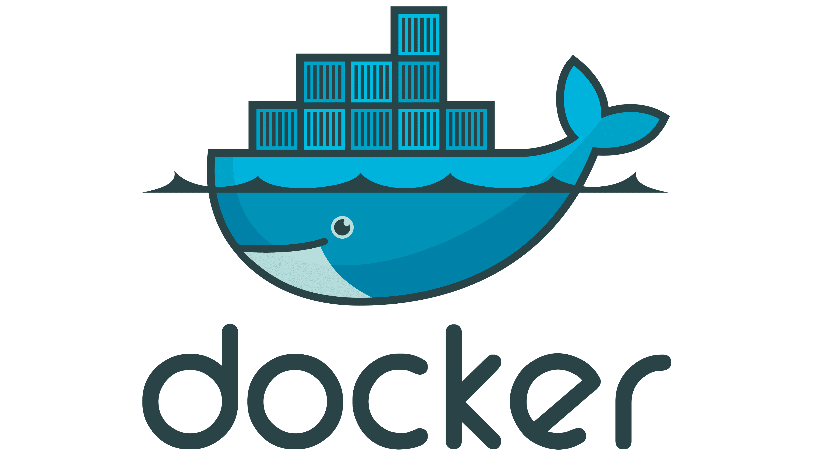
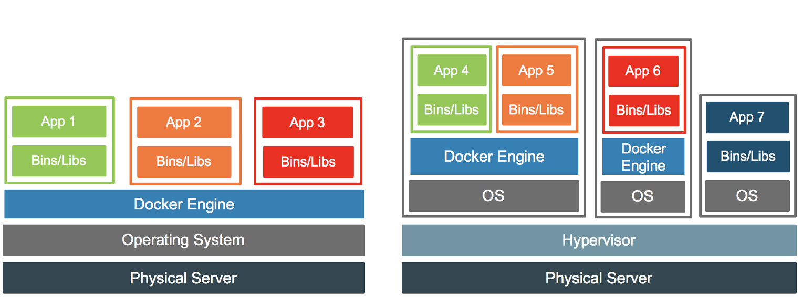
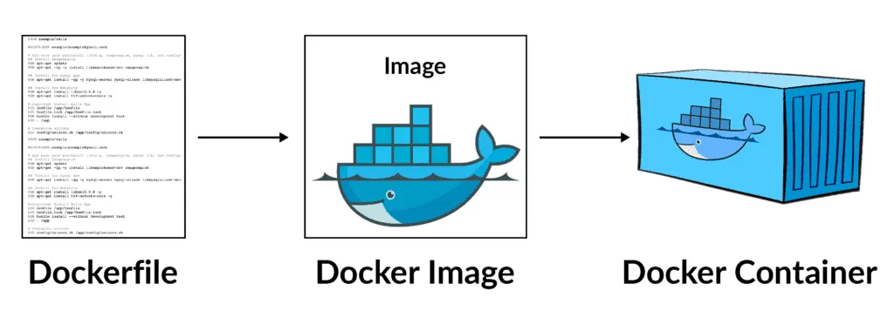
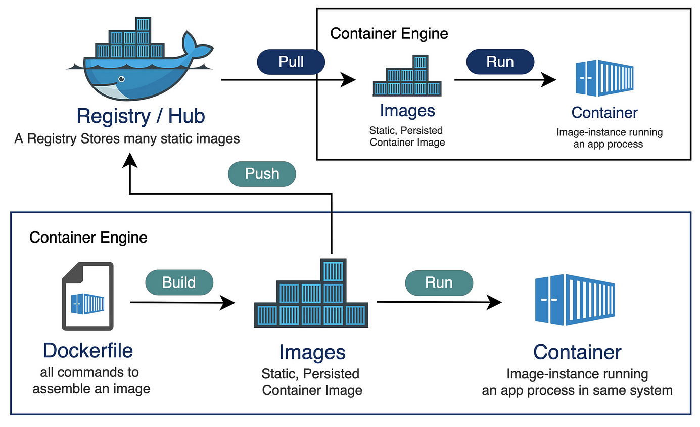

<div class="title-card">
    <h1>Docker</h1>
</div>

---

# What is Docker?

An easy way to create, deploy, and run applications using containers.

Images are defined in a Dockerfile (YAML). Example:

```Dockerfile
FROM maven:3.9.9-eclipse-temurin-21 AS build

WORKDIR /app
COPY pom.xml .
COPY src ./src
RUN mvn clean package -DskipTests

FROM eclipse-temurin:21-jdk-alpine
WORKDIR /app
COPY --from=build /app/target/*.jar app.jar

ENTRYPOINT ["java", "-jar", "app.jar"]
```

(You are not expected to understand this file right away.)


---

# An analogy for Dockerfile, image and container

- **Dockerfile**: A recipe for a cake.

- **Docker Image**: The cake itself, built from the recipe. 

- **Docker Container**: The cake that is served.



---

# Why Docker?

Docker is difficult to learn, takes more time to set up but is worth it in the long run.

**Ease of running**: Start and stop containers with a single command.

**Dependency Management**: Containers package an application and its dependencies together, ensuring that it runs consistently across different environments.

**Reproducibility**: Solves the "works on my machine" problem by abstracting away from the host OS.

---

# Virtualiaztion vs. Containerization

Containers are lightweight compared to VMs.

- **Virtualization**: Virtualizes the hardware, running a full OS with its own kernel.

- **Docker**: Virtualizes the OS, sharing the kernel and isolating processes. Much more lightweight and efficient than VMs.




[Source](https://www.docker.com/blog/containers-and-vms-together/)


---

# Docker Terminology

- **Dockerfile**: YAML file that contains instructions to build an image (base image, deps, config).

- **Docker Image**: A read-only template that contains the application code, libraries, and dependencies needed to run an application.

- **Docker Container**: A running instance of a Docker image. It includes everything needed to run the application.

- **Docker Engine**: The runtime platform that builds and runs containers.



[Source](https://celik-muhammed.medium.com/efficient-docker-image-creation-a-step-by-step-guide-553fe3fa00b1)

---

# Docker Hub and Registries

[Docker Hub](https://hub.docker.com/) is Docker's own registry for distributing Docker images.

It hosts a vast collection of pre-built images for various applications and services.

It is possible to add your own images to Docker Hub.



[Source](https://community.sap.com/t5/technology-blog-posts-by-sap/use-private-registry-for-containerize-a-cap-application-part-1/ba-p/13541667)


