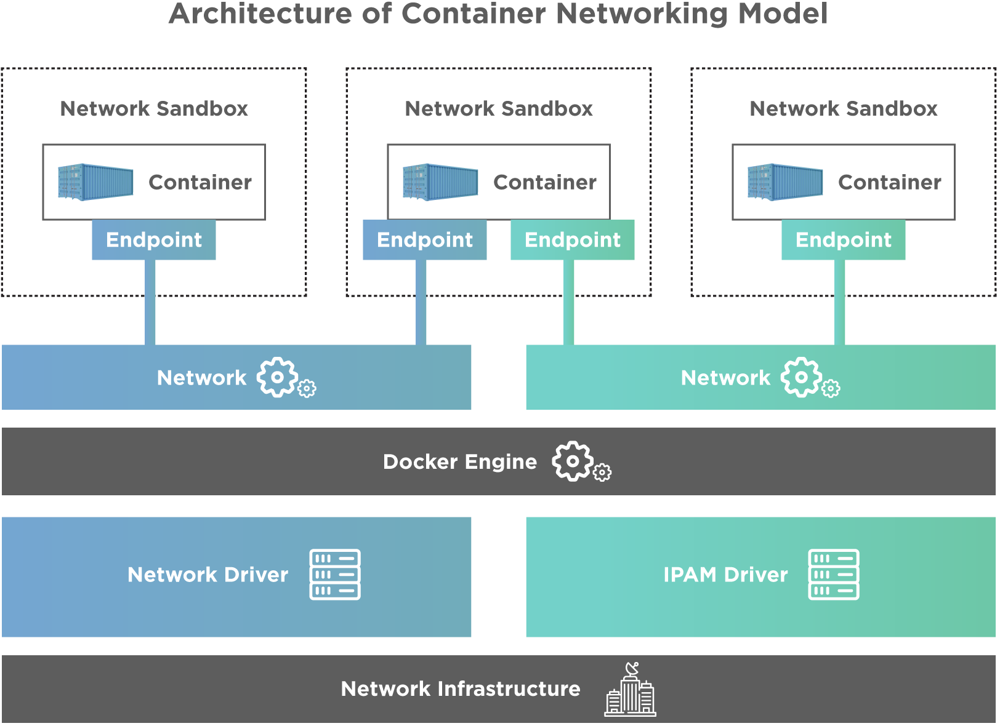
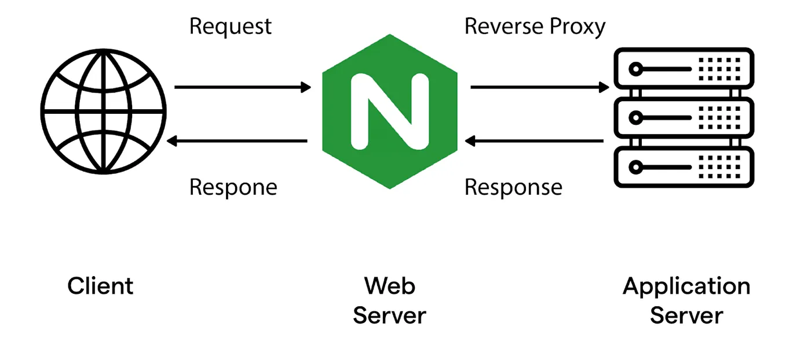

<div class="title-card">
    <h1>Docker Networks</h1>
</div>

---

# Networking in Docker

Without networks containers would neither be able to communicate with each other nor be accessible from the host machine.

Docker provides a default network for containers to communicate with each other and the host machine.

Use the `docker network` command to manage networks and connect containers to them.



[Source](https://www.toolsqa.com/docker/docker-networking/)

---

# Why Networks?

Networks are useful for:

1. Allowing containers to communicate with each other and the host machine.

2. Isolating containers from the host machine and other networks.

3. Managing network configurations and settings.

---

# What is Nginx?

Nginx is a popular web server that can also be used as a reverse proxy (see the image below), load balancer and HTTP cache.



We are going to use it as a simple web server that serves an HTML file.

---

# Networking: Port mapping

Nginx listens on port 80 by default and we will use port mapping to expose it on a different port on our host machine.

**Port mapping**: Map a the **host machine port** to the Docker **container port**.

To map a port, use the `-p` option when running a container.

```bash
docker run -p <host-port>:<container-port> <image-name>
```

We need port mapping to be able to access a service (web server, database etc.) from outside the container.


We can also map a container port to a different host port if it's in use (running other services / containers using the same port):

```bash
docker run -p 8080:80 nginx
```

**Question**: *In the line above, what should I type in my browser to access the Nginx web server? What port does Nginx listen to inside the container?*

---

# Exercise - Exposing Ports

Read and follow the exercise **Docker Exposing Ports**

You can find it in the semester plan under the exercises column. 

If you have extra time, you could start on **Docker Execute Commands**.

Any exercise not completed in class is considered homework.
