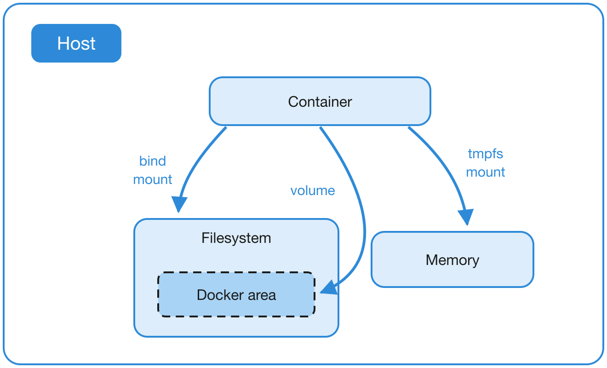

<div class="title-card">
    <h1>Docker Volumes</h1>
</div>

---

# What are Docker Volumes?

*Docker Volumes* are used to persist data generated by and used by Docker containers. 

Example: If you have a database container, you wouldn't want to lose your data every time you stop the container.

This is solved with *Docker Volumes*, which allow you to store data outside of the container's filesystem.

---

# Bind mounts

**Bind mounts** allow you to mount a directory from your host machine into a Docker container.

This is useful for development, as it allows you to edit files on your host machine and see the changes reflected in the container immediately.

To use a bind mount, you can use the `-v` option when running a container.

```bash
docker run -v /path/on/host:/path/in/container <image-name>
```

---

# Bind mounts vs. Volumes

* Bind mounts are tied to a specific host path, while volumes are managed by Docker and can be easily shared between containers.

You will work with both in the **Docker bind mounts and volumes assignment** after class.

