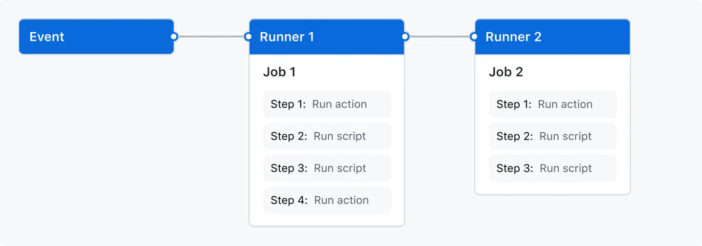

<div class="title-card">
    <h1>GitHub Actions</h1>
</div>

---

# Info Dump Me

*What do you know about GitHub Actions?*

*Tell me what you remember from last semester.*

---

# Moving Parts of a Workflow

**Workflow**: Automated process defined in a YAML file, triggered by events.

**Job**: A set of steps that execute on the same runner.

**Step**: A single task within a job, can be an action or a shell command.

**Action**: A reusable unit of code that can be shared and used in workflows.



---

# GitHub Actions Quiz

*What file format is a workflow defined in?*

<details> 
  <summary>Answer</summary>
   yaml
</details>


*Where should the workflow file be placed?*

<details> 
  <summary>Answer</summary>
   .github/workflows/
</details>

*Give at least 3 examples of what a workflow can be made to do.*

<details> 
  <summary>Answer</summary>
   - Run tests on code changes
   - Build and deploy applications
   - Automate code reviews and pull requests
   - Send notifications on specific events
   - Perform security checks and vulnerability scans
</details>


---

# What does this workflow do?

```yaml
name: Java CI

on:
  push:
    branches:
      - main
  pull_request:
    branches:
      - main

jobs:
  test:
    runs-on: ubuntu-latest
    steps:
      - uses: actions/checkout@v4
      - name: Set up JDK
        uses: actions/setup-java@v4
        with:
          java-version: "21"
          distribution: "temurin"
      - name: Run tests
        run: mvn test
```


---

# GitHub Actions Marketplace

Use pre-built actions in your workflows.

https://github.com/marketplace?type=actions

*What Action did you use during last semester?*

<details> 
  <summary>Example</summary>
   https://github.com/anderslatif/tech1_countries/blob/main/.github/workflows/main_mywebappscript.yml
</details>

---


# Popular GitHub Actions

| Action | Description |
| --- | --- |
| [actions/checkout](https://github.com/actions/checkout) | Checks out your repository, so your workflow can access it. |
| [actions/setup-java](https://github.com/actions/setup-java) | Sets up a specific version of Java in your GitHub Actions runner environment. |
| [actions/cache](https://github.com/actions/cache) | Caches dependencies and build outputs to improve workflow execution time. |
| [actions/upload-artifact](https://github.com/actions/upload-artifact) | Uploads artifacts from a workflow for later use. |
| [actions/download-artifact](https://github.com/actions/download-artifact) | Downloads artifacts that were uploaded in a workflow. |
| [docker/build-push-action](https://github.com/docker/build-push-action) | Builds and pushes Docker images. |
| [docker/login-action](https://github.com/docker/login-action) | Logs into a Docker registry. |
| [docker/metadata-action](https://github.com/docker/metadata-action) | Generates metadata for Docker images. |

---

# Exercises

Solve exercise `01` - `02`.
