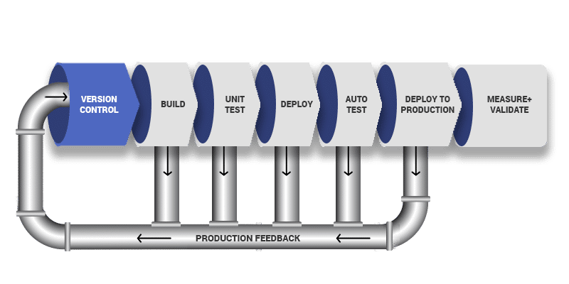
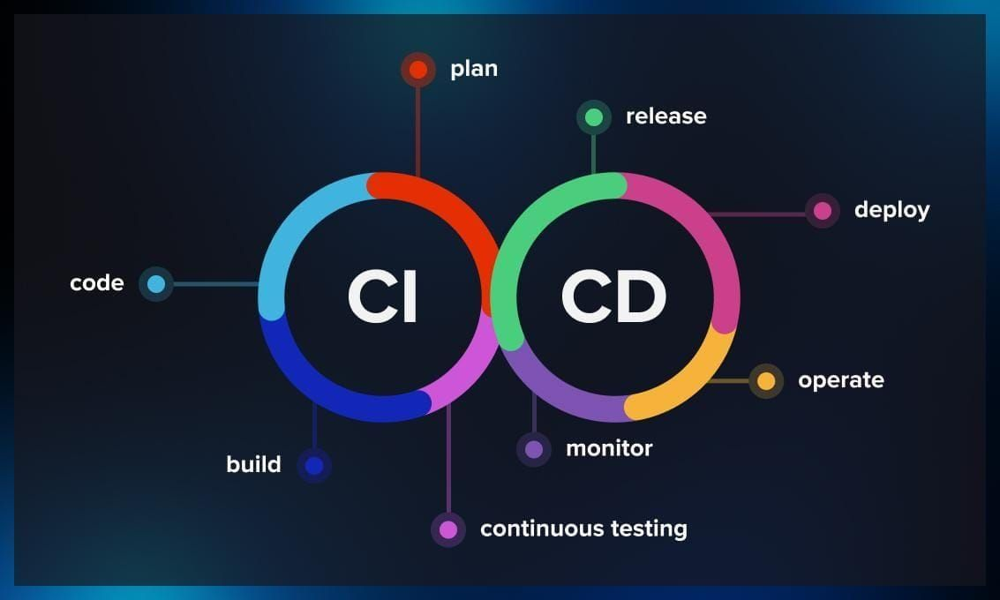

<div class="title-card">
    <h1>CI / CD</h1>
</div>

---

# Pipeline

A term used when zooming out and seeing the multiple jobs or workflows that run sequentially (as if it were flowing through a pipe).

For instance, the CI/CD pipeline could consist of two workflows CI and CD.

If the pipeline breaks (for instance, the CI workflow fails), the CD workflow will not run.



[Source](https://www.mend.io/blog/devops-pipeline-tools/)

---

# CI/CD: Two step process

1. **Continuous Integration**: Make sure that you have a working application.

2. **Continuous Deployment**: Deploy it to a server or make the image available in a container registry.



[Source](https://serokell.io/blog/continuous-delivery-with-nix)

---

# Continuous Integration

The same "integration" as in integration tests. But many other things can happen here.


---

# Continuous Deployment

In Tech 2 we will understand `CD` through the lens of working with Docker. 

Here we will build a Docker image on a GitHub Actions runner and push it to GitHub Container Registry (GHCR).

In Tech 2 we will manually `SSH` into our deployment VMs and get Docker Compose to pull and run the images.

This could be automated so that it deploys automatically.

---

# GitHub Container Registry (GHCR)

We will use GitHub Container Registry (GHCR) to store our Docker images.

* It's free.

* We are already using GitHub Actions, so it is convenient to use GHCR.

We could also use Docker Hub, but it only allows 1 private repository in free tier.


---

# Defining GHCR in the Compose file

Consider this `compose.yaml` file that builds the image from the Dockerfile in the current directory:

```yaml
services:
  app:
    build:
      context: .
      dockerfile: Dockerfile
      # ...
```

Instead, we can define the image to be pulled from GHCR (notice that we have removed the `build` section and added the `image` key):

```yaml
services:
  app:
    image: ghcr.io/<username>/<repository>:latest
    # ...
```

Instead of having to pull all the code and build it on the server, we just pull the prebuilt image from GHCR and run it.

*Pros and cons of this approach?*

---

# Pros and cons of using a container registry versus building on the server

* (+) Speed: No build time on the server = less downtime when redeploying.

* (+) Less resource intensive: Not building on the server = less CPU and RAM usage. No source code = less disk space usage on the server.

* (+) Security: No code ever touches the server.

* (+) Easy dependency management: The only dependency required on the server is Docker.

* (+) Easy rollback: If the new image is broken, we can just pull the previous image from the registry and run it.

* (-) More work / configuration: The setup requires two files: one for development (`compose.dev.yaml`) and one for production (`compose.prod.yaml`).

---

# Homework

[CI/CD Pairing Game](https://anderslatif.github.io/ci_cd_pairing_game).