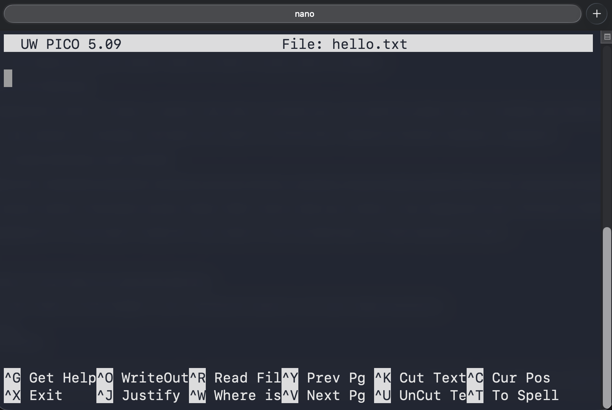
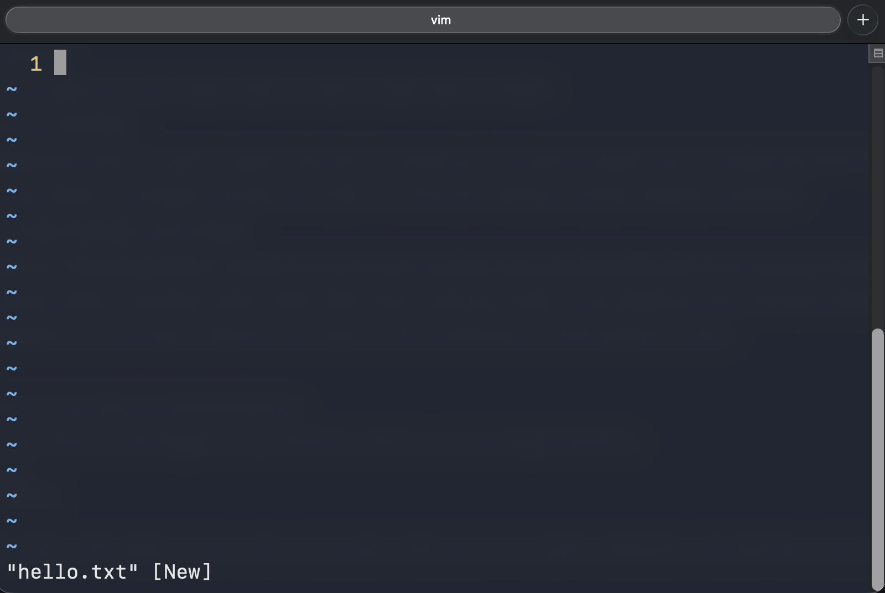
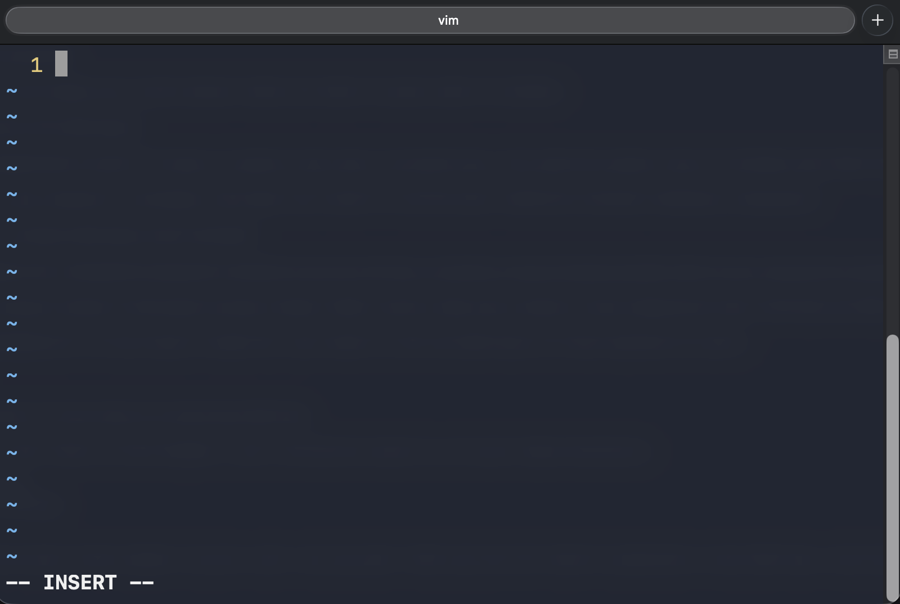
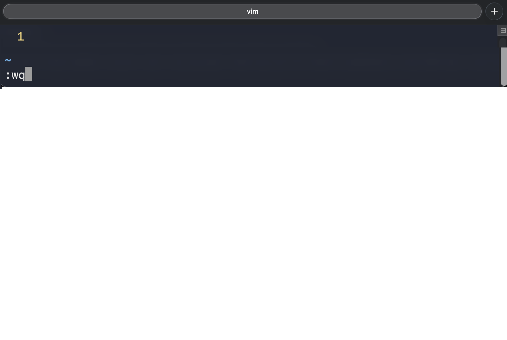

<div class="title-card">
    <h1>Text Editors</h1>
</div>

---

# nano

Replace `<filename>` with the name of the file you want to edit. 

If it doesn't exist, nano will create it for you.

```bash
nano <filename>
```



`^` = `CTRL` key

`CTRL+O` = Write out (save) the file
`CTRL+X` = Exit nano. You will be prompted to save if you have unsaved changes.

---

# Vim - Multiple Modes

Vim is more complex due to its different modes but this also makes it more powerful.

Knowing basic Vim is useful because it is the default editor for Git. If you forget to add a commit message with git, it will open Vim.

- **Normal Mode**: Default mode for navigation and command execution.



---

# Vim - Multiple Modes

- **Insert Mode**: Allows typing and editing text, similar to standard text editors. Press `i` to enter insert mode, and `ESC` to return to normal mode.



- **Visual Mode**: Enables text selection using arrow keys; supports standard clipboard operations. Press `v`.

- **Visual Block Mode**: Facilitates block-shaped text selection and manipulation.

---

# Quitting in Vim

Hit escape a couple of times to go to normal mode in order to run command with the colon symbol (`:`).

Save (**w**rite) and **q**uit:

```plaintext
:wq
```

Quit (requires a save first if there are unsaved changes)

```plaintext
:q
```

Quit without saving:

```plaintext
:q!
```



---

# Text Editors - Windows: 

Nano is installed with Git Bash:

```powershell
$ nano <filename>
```

Or use external editors outside of the terminal:

```powershell
$ notepad <filename>
```

If you have VSCode installed:

```powershell
$ code <filename>
```


---


# Text Editors in *nix Systems

#### **Nano**: Simpler for beginners.

#### **Vi/Vim**: Advanced and Powerful: Offers extensive functionality for complex editing tasks.


---

# Quitting in the terminal in general

The last part is not only about files but it's generally useful how to quit any program in the terminal.

Different programs have different ways to terminate them. The most common are:

```plaintext
q
```

```plaintext
CTRL-C
```

```plaintext
CTRL-D
```


