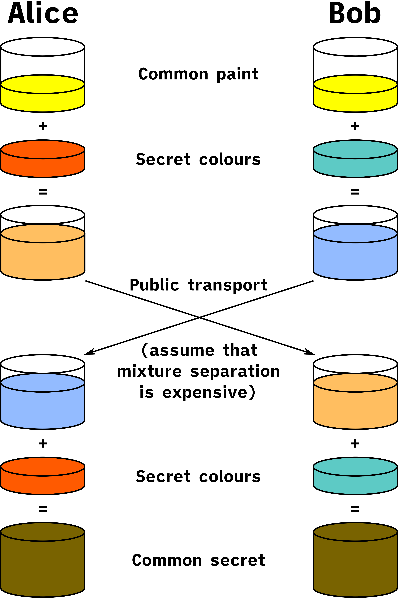

<div class="title-card">
    <h1>Encryption</h1>
</div>

---

# Why Learn Hashing / Encryption?

Last week you learned **hashing**. It is useful for understanding what it means to hash passwords in the database. They should never be stored in plain text.

Now the focus is on a shallow understanding of **encryption**. It can help you with:

- SSH. 

  - Understanding why it is the public key that should be added to servers to allow access.

  - Understanding why it is the private key that should be added to GitHub Secrets if a GitHub Action needs to access a server.

- HTTPS.

  - Understanding how certificates work.


---

# Symmetric Encryption

**Symmetric encryption**: A single key.

Must be exchanged securely without interception.

*Can you think of a former widely adopted symmetric encryption scheme in Denmark?*

<details> 
  <summary>Answer</summary>
   NemID used to require a physical key card full of symmetric keys.
</details>


---

# Private - Public Keys

**Asymmetric Encryption**: Two types of keys - private and public.

There are many encryption scheme. We will use RSA. It works because it is computationally easy to multiply two large primes together but very difficult to factor the product back into its original primes.

RSA produces two keys. `ls` the `.ssh` directory in your home folder and tell me what they are called.

<details> 
  <summary>Answer</summary>
   id_rsa (private key) and id_rsa.pub (public key)
</details>

You can share the public key with anyone. We will paste it to Azure next week so that we can access the servers we can create.

We should never give our private key out. It exists locally to verify with the public key that we are the owner of the private key.


---

# Private - Public Key Encryption



[Source](https://en.wikipedia.org/wiki/Diffie%E2%80%93Hellman_key_exchange#General_overview)


---


<div class="title-card">
    <h1>SSH</h1>
</div>

---

# SSH

SSH allows us to securely connect to a remote server and execute commands on it through out terminal.

This is the command to connect (remember to replace `<username>` and `<ip-address>` with your actual values):

```bash
ssh <username>@<ip-address>
```

Try it out on a [free server](https://github.com/mrx7014/SSH-KaliLinux).

Can you figure it out? Here are the credentials:

**Username**: `root`
**Server Address**: `segfault.net`
**Password**: `segfault`

The first time you try to SSH into a server, you will be prompted to accept the server's fingerprint. Basically, it is asking if you trust the server. 

Type `yes` and press Enter.

