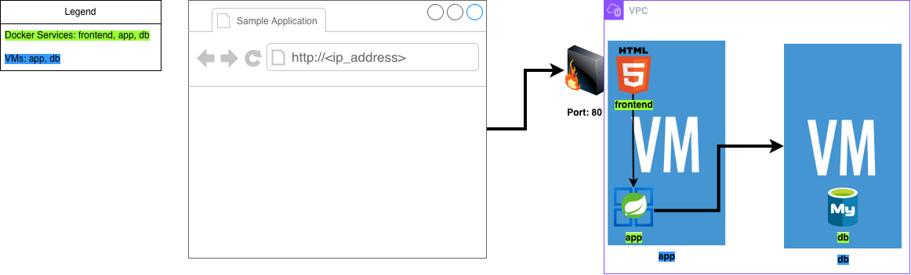

# Deploying dockerized application on multiple VMs

In this exercise, we will deploy a dockerized application on multiple VMs. The goal is to create a setup like this:



The VPC (Virtual Private Cloud) is a private network that allows the VMs to communicate with each other. It will provide a secure and isolated environment for the application. Only the frontend on port 80 will be accessible from the internet.

You should have two VMs:
- `1GB RAM / 1 CPU`: This VM will run the backend and frontend containers.
- `2GB RAM / 1 CPU`: This VM will run the database container.

**Note**: It is crucial that the database VM has at least 2GB of RAM.

We will use a [sample application](https://github.com/ek-osnb/cloud-starter), that has:
- A Spring Boot application that connects to a MySQL database.
- A frontend Single page application (with client side routing) that connects to the Spring Boot application.
- A MySQL database that stores the data.

For simplicity, we will run both the spring boot app and the frontend app on the same VM, and the database on the other VM.


## Step 0: Fork and clone the repository
For this to work, you need to have your own copy of the [sample application](https://github.com/ek-osnb/cloud-starter). You can achieve this by forking the repository and then cloning it to your local machine.

Open the repository up in your editor, and take a look at the `compose.prod.app.yaml`.

You need to replace the image names in the `compose.prod.app.yaml` file to point to your own GHCR repository. The image names should be in the following format:
```bash
ghcr.io/GITHUB_USERNAME/cloud-starter/app:latest
```
Make sure to replace `GITHUB_USERNAME` in **BOTH** locations with your actual GitHub username. This will ensure that when we run the application, it will pull the images from your GHCR repository. Also change `cloud-starter` to the name of your forked repository.

Go to the `Actions` tab in your forked repository and click on the green button that says: "I understand my workflows, go ahead and enable them". By default, GitHub Actions are disabled for forked repositories as a security measure.

**Commit and push the changes to your forked repository on GitHub.**


# Step 1: Install Docker on both VMs

Install Docker on both VMs by following the instructions in the docker installation guide. You can use the same installation script for both VMs. Make sure to run the script on both VMs to install Docker.

Make sure to test that Docker is installed correctly on both VMs by running `sudo systemctl status docker` and checking that the Docker service is active and running.


## Step 2: Create a Release on GitHub
Before we can deploy our application, we need to create a release on GitHub. There is a workflow that automatically builds and pushes the Docker images to GitHub Container Registry (GHCR) when a new release is created.

To create a release, head to the "Releases" section in the right side of your forked repository on GitHub and click on "Draft a new release". Give your release a tag (e.g., `v0.0.1`) and a title, then click on "Publish release".

The release will trigger the workflow that builds and pushes the Docker images to GHCR.


## Step 3: Initial Setup
ssh into the DB VM, and create a new directory called `db` and navigate into it:

```bash
mkdir db
cd db
```
Then, download the `compose.prod.db.yaml` file over to the `db` directory:

```bash
curl -L https://raw.githubusercontent.com/ek-osnb/cloud-starter/refs/heads/main/compose.prod.db.yml -o compose.prod.db.yaml
```

This will download the `compose.prod.db.yaml` file from the GitHub repository and save it in the `db` directory. This file contains the Docker Compose configuration for the MySQL database.

Download the sample `.env` file and save it in the `db` directory:

```bash
curl -L https://raw.githubusercontent.com/ek-osnb/cloud-starter/refs/heads/main/.env -o .env
```

This will download the `.env` file from the GitHub repository and save it in the `db` directory. This file contains the environment variables for the MySQL database. 

Note: Since `.env` is a hidden file (starts with `.`), you won't be able to see it with the `ls` command unless you add the `-a` flag for all: `ls -a`.

> Change the `MYSQL_ROOT_PASSWORD` variable in the `.env` file to a strong password of your choice. This password will be used to access the MySQL database.


## Step 4: Exposing the database to the VPC

For security reasons, we will not expose the database to the public internet. Instead, we will only allow access to the database from other VMs in the same VPC. To do this, we will need to modify the `.env` file and set the `MYSQL_PRIVATE_IP` variable to only be exposed to the private IP addresses of the VMs in the same VPC.

Look up the private IP address of the DB VM. You can find this under `eth0` by running the following command:

```bash
ip addr show
```

It is the first number, not the subnet mask. For example, if the output is:

```bash
eth0: <BROADCAST,MULTICAST,UP,LOWER_UP> mtu 1500 qdisc mq state UP group default qlen 1000
    link/ether 7c:ed:8d:9c:c5:70 brd ff:ff:ff:ff:ff:ff
    inet 10.0.2.4/24 brd 10.0.2.255 scope global noprefixroute eth0
	   valid_lft forever preferred_lft forever
```

Then the private IP address is `10.0.2.4`.

Copy the private IP address of the VM and set the `MYSQL_PRIVATE_IP` variable in the `.env` file to the following:

```bash
MYSQL_PRIVATE_IP=<REPLACE_WITH_PRIVATE_IP>
```


## Step 5: Creating a Personal Access Token (PAT) for GHCR
To pull the Docker images from GitHub Container Registry (GHCR), we need to authenticate with GHCR using a Personal Access Token (PAT). 

1. Go to [https://github.com/settings/tokens](https://github.com/settings/tokens) and click **Generate new token** use the **classic** option.
2. Give your token a name and select the following scopes:
	- `read:packages` (to pull images)
3. Generate the token and **copy it somewhere safe** (you won't be able to see it again).

## Step 6: Authenticate with GHCR and run the database container
You need to authenticate with GHCR on the DB VM using the PAT you just created:

```bash
echo YOUR_PAT | docker login ghcr.io -u YOUR_GITHUB_USERNAME --password-stdin
```
Replace `YOUR_PAT` and `YOUR_GITHUB_USERNAME` with your actual values.

This command will log you in to GHCR using your GitHub username and the PAT you created. This will allow you to pull the Docker images from GHCR.


Now that we have the Docker Compose file and the environment variables set up, we can run the database container on the DB VM. Navigate to the `db` directory and run the following command:

```bash
docker compose -f compose.prod.db.yaml up -d
```

This command will start the MySQL database container in detached mode (running in the background). The `-f` flag specifies the Docker Compose file to use.

You can check that the container is running by using the following command:

```bash
docker ps -a
```

## Step 7: Running the application

Now that the database is running, you can exit the db VM (type `exit` in the terminal). Then, ssh into the app VM:

```bash
ssh root@APP_VM_IP_ADDRESS
```
Replace `APP_VM_IP_ADDRESS` with the actual public IP address of the app VM.


Create a new directory called `app` and navigate into it:

```bash
mkdir app
cd app
```

And download the `compose.prod.app.yaml` file from **your forked repository**:

```bash
curl -L https://raw.githubusercontent.com/YOUR_GITHUB_USERNAME/cloud-starter/refs/heads/main/compose.prod.app.yml -o compose.prod.app.yaml
```
Replace `YOUR_GITHUB_USERNAME` with your actual GitHub username. This ensures you get the version with your own GHCR image names that you updated in Step 0.

Also download the sample `.env` file and save it in the `app` directory:

```bash
curl -L https://raw.githubusercontent.com/ek-osnb/cloud-starter/refs/heads/main/.env -o .env
```
This file contains the environment variables for the Spring Boot application and the frontend application.

> Change the `SPRING_DATASOURCE_URL` variable in the `.env` file to point to the private IP address of the DB VM. The format should be as follows:
```bash
SPRING_DATASOURCE_URL=jdbc:mysql://DB_VM_PRIVATE_IP:3306/mydb
```
Replace `DB_VM_PRIVATE_IP` with the actual private IP address of the DB VM.

Authenticate with GHCR on the app VM using the same command as before:

```bash
echo YOUR_PAT | docker login ghcr.io -u YOUR_GITHUB_USERNAME --password-stdin
```
Replace `YOUR_PAT` and `YOUR_GITHUB_USERNAME` with your actual values.

Now that we have the Docker Compose file and the environment variables set up, we can run the application containers on the app VM. Run the following command:

```bash
docker compose -f compose.prod.app.yaml up -d
```
This command will start the Spring Boot application and the frontend application containers in detached mode (running in the background). The `-f` flag specifies the Docker Compose file to use.

You can check that the containers are running by using the following command:

```bash
docker ps -a
```

## Step 8: Test the application

Remember to allow traffic on port 80.

To test that the application is running correctly, open a web browser and navigate to the public IP address of the app VM. You should see the frontend application running. 

You can also test that the frontend application can communicate with the Spring Boot application and the database by creating a new item in the frontend application and checking that it is stored in the database.

It should work now!
